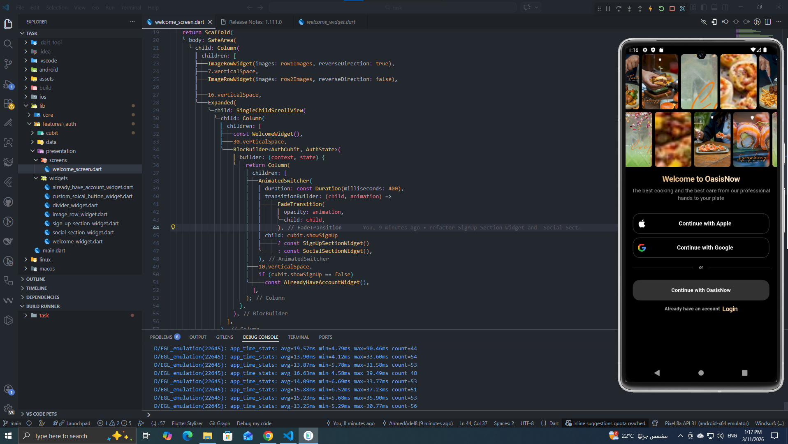
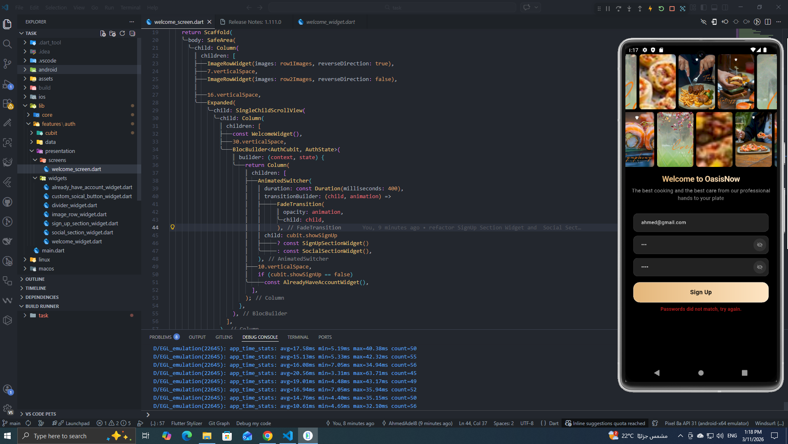
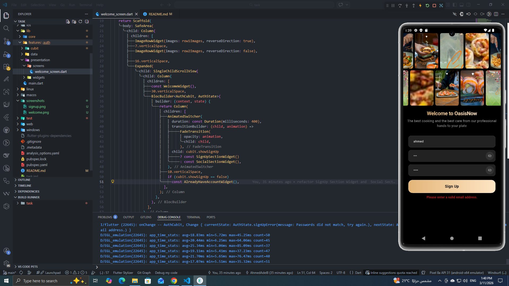
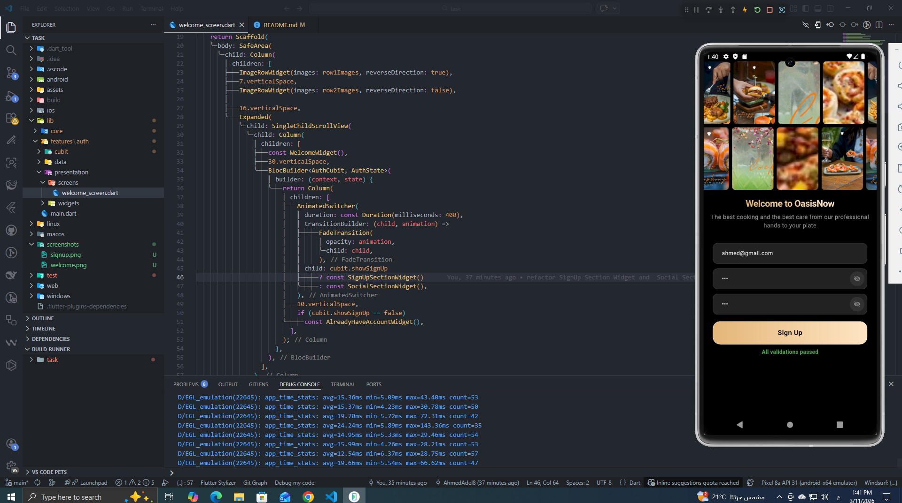

# task
<<<<<<< HEAD

A Flutter project showcasing clean architecture, state management, and smooth animations.

##  Tech Stack & Architecture

- **Clean Architecture** – Clear separation between data, logic, and presentation layers
- **Clean Code** – Readable, maintainable, and well-structured codebase
- **Retrofit** – Type-safe HTTP client for API integration
- **Cubit (BLoC)** – Predictable state management using flutter_bloc
- **Animations** – Custom transitions and micro-interactions for a polished UX

##  What Was Implemented

- Clean folder structure following feature-first architecture
- Retrofit with Dio for network layer
- Cubit for managing UI state across screens
- Form validation with real-time feedback
- Smooth page and widget animations

## Screenshots

  
  
  
  

=======
A new Flutter project.
## Getting Started
This project is a starting point for a Flutter application.
A few resources to get you started if this is your first Flutter project:
- [Lab: Write your first Flutter app](https://docs.flutter.dev/get-started/codelab)
- [Cookbook: Useful Flutter samples](https://docs.flutter.dev/cookbook)
For help getting started with Flutter development, view the
[online documentation](https://docs.flutter.dev/), which offers tutorials,
samples, guidance on mobile development, and a full API reference.
>>>>>>> f86d8f549afc07332c24aa0654d9248c189db2ad
